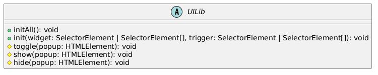
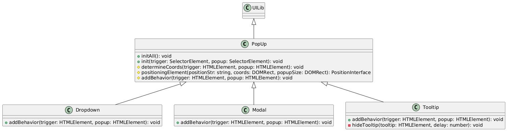
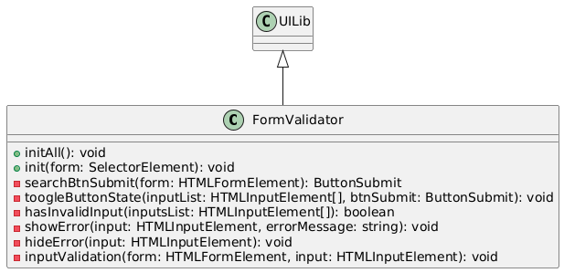
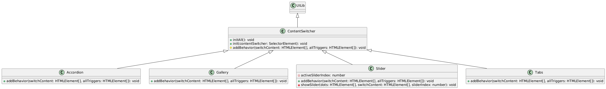
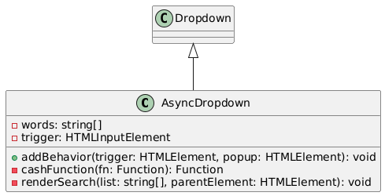
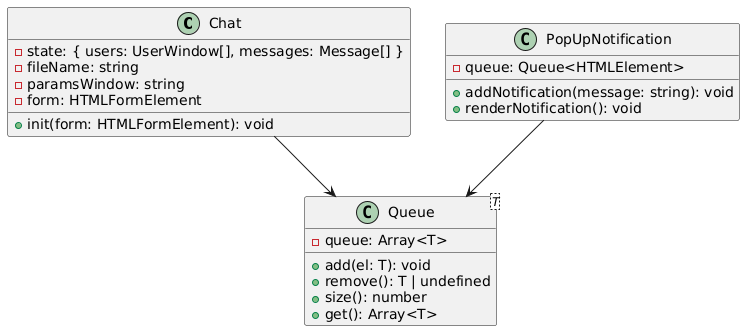
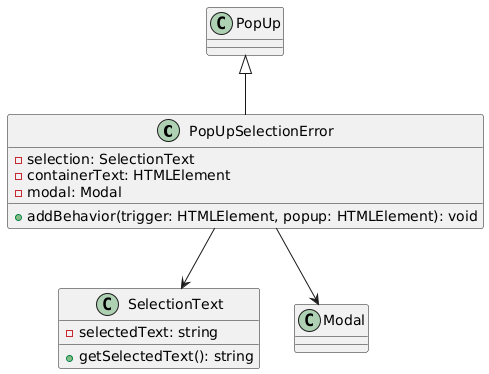

<h1 align="center">Compact UI library (OOP)</h1>
<p align="center">
  <em>This library is a set of reusable components that simplify the creation of interactive and adaptive user interfaces. A handy tool when you need to use OOP in interfaces, the library will continue to be updated, this is not its latest version. Under the hood, the library uses pure TypeScript.</em>
</p>

## Documentation language
- [Дока на русском](./docs/README.ru.md)

## Navigation in documentation
- [Project Structure](#section-lib-structure)
  - [Global Structure](#section-global-structure)
  - [Important files](#section-important-files)

- [How to use](#section-how-to-use)
  - [Download lib](#dwn-lib)
  - [Import Lib](#import-lib)
  - [Use Components](#use-components)
    - [Use PopUp](#use-component-1)
    - [Use Tooltip](#use-component-2)
    - [Use FormValidator](#use-component-3)
    - [Use Chat](#use-component-4)
    - [Use PopUpNotification](#use-component-5)

- [Components](#section-components)
  - [Core UI Library](#section-ui-framework)
  - [Popups & Modals](#section-popups-modals)
  - [Form Validation](#section-form-validation)
  - [Content Switching](#section-content-switching)
  - [Async Components](#section-async-components)
  - [Chat & Queue](#section-сhat-queue)
  - [Text Selection Errors](#section-text-selection-errors)

- [TODO](#section-todo)

- [Author](#section-author)
  - [Kirill Doroshev](https://github.com/dkmfzf)

- [License](#section-license)

<h2 id="section-lib-structure">
  Lib structure
</h2>

<h3 id="section-global-structure">
  Global Structure
</h3>

- src/ — project source files
- src/Components/Chat — chat component folder
- src/Components/Notification — the folder with the message component
- src/Components/PopUpSelectionError — folder with the error selection component
- src/ContentSwitcher — folder with the content switch component
- src/FormValidation — folder with the form validation component
- src/PopUp — folder with pop-up window components

<h3 id="section-important-files">
  Important files
</h3>

- src/index.ts — the main library file
- src/UILib.ts — the main library lifecycle file
- src/utils/utils.ts — a file with auxiliary functions

<h2 id="section-how-to-use">
  How To Use
</h2>

__DISCLAIMER: The library is in its very first build, and it will later be added to the `npm` package infrastructure. At the moment, it is only available through explicit use in the project.__

In order to use the library, you need to import it into your project, and all files in src/ (it is advisable to create a separate directory for this, for example: ``src/lib/'library file"`).
After the files are imported, you can start creating components and use them in your project.

<h3 id="dwn-lib">
  1. Installing the library
</h3>

```bash
git clone https://github.com/DKMFzF/web-ui-library.git
```

<h3 id="import-lib">
  2. Import the library into the project
</h3>

```TypeScript
// index.ts (located at the root of the project)

import {
  UILib,
  PopUp,
  Tooltip,
  Modal,
  Dropdown,
  FormValidator,
  Accordion,
  ContentSwitcher,
  Gallery,
  Slider,
  Tabs,
  AsyncDropdown,
  PopUpNotification,
  NotificationElement,
  PopUpSelectionError,
  Queue,
  Chat,
} from './lib/index.ts';
```

<h3 id="use-components">
  3. Using the components
</h3>

Now you can use the components and functions from the library in your project. Here are some examples:

<h4 id="use-component-1">
  3.1 Using PopUp
</h4>

```TypeScript
  const popup = new PopUp();
  popup.initAll(); // Initialization of all pop-up windows on the page
```

<h4 id="use-component-2">
  3.2 Using Tooltip
</h4>

```TypeScript
  const tooltip = new Tooltip();
  tooltip.init('[data-trigger-tooltip]', '[data-content-tooltip]'); // Initializing tooltips
```

<h4 id="use-component-3">
  3.3 Using the FormValidator
</h4>

```TypeScript
  const formValidator = new FormValidator();
  formValidator.initAll(); // Initialization of validation of all forms on the page
```

<h4 id="use-component-4">
  3.4 Using Chat
</h4>

```TypeScript
  const chat = new Chat({
    nameFile: 'chat.html',
    widthWindow: 400,
    heightWindow: 600,
    form: document.querySelector('#chat-form'), // User name input form
  });
```

<h4 id="use-component-5">
  3.5 Using PopUpNotification
</h4>

```TypeScript
  const popupNotification = new PopUpNotification();
  popupNotification.addNotification('New notification!');
  popupNotification.renderNotification(); // Notification display
```

**4. HTML Settings**  
Some components (for example, PopUp, Tooltip, Dropdown) require a specific HTML structure to work. For example:

**4.1 For PopUp**
```HTML
  <button data-trigger-popup="myPopup">Open PopUp</button>
  <div id="myPopup" data-content-popup>
    <p>It's a pop-up window!</p>
  </div>
```

**4.2 For Tooltip:**
```HTML
  <button data-trigger-tooltip="myTooltip">Point it at me</button>
  <div id="myTooltip" data-content-tooltip>
    <p>This is a tooltip!</p>
  </div>
```

**4.3 For FormVali**
```HTML
  <form data-form>
    <input type="text" class="form__input" required>
    <button type="submit">Send</button>
  </form>
```

**5. Customize styles**  
Make sure that you have styles enabled for the components. For example, PopUp and Tooltip may require CSS classes such as widget_hidden, display_flex, and others.
```CSS
  .widget_hidden {
    display: none;
  }

  .display_flex {
    display: flex;
  }
```

**6. Using utilities**
You can use utilities like ensureElement, ensureAllElements, capitalizeFirst, and others in your code. For example:
```JavaScript
  import { ensureElement, capitalizeFirst } from 'your path to the library';

  const element = ensureElement('#myElement'); // Getting the element
  const capitalizedString = capitalizeFirst('hello'); // "Hello"
```

**7. An example of full usage**
Here is an example of using multiple components together:
```JavaScript
  import { PopUp, Tooltip, FormValidator, Chat } from 'your way to the library';

  // Initializing the PopUp
  const popup = new PopUp();
  popup.initAll();

  // Initialization of the Tooltip
  const tooltip = new Tooltip();
  tooltip.init('[data-trigger-tooltip]', '[data-content-tooltip]');

  // Initializing the FormValidator
  const formValidator = new FormValidator();
  formValidator.initAll();

  // Initialization of Chat
  const chat = new Chat({
    nameFile: 'chat.html',
    widthWindow: 400,
    heightWindow: 600,
    form: document.querySelector('#chat-form'),
  });
```

<h2 id="section-components">
  Components
</h2>

This section describes all the components that are used in the library. The components are accompanied by UML diagrams that clearly show the relationships between the components. To reduce the space in some components **, the visualization is reduced**. This means that the component was described above and a repeat description was not required.

<h3 id="section-ui-framework">
  Basic UI Framework (Core UI Library)
</h3>

An abstract class that serves as the basis for all UI components. It defines the basic methods for initializing interface elements and managing their state (showing, hiding, switching).

Methods:
- ``initAll(): void`` — Initializes all UI components on the page.
- ``init(widget: SelectorElement | SelectorElement[], trigger: SelectorElement | SelectorElement[]): void`` — Initializes a specific component with the specified trigger.
- ``toggle(popup: HTMLElement): void`` — Switches the visibility of the popup element.
- ``show(popup: HTMLElement): void`` — Shows a popup element.
- ``hide(popup: HTMLElement): void`` — Hides the popup element.

How can it be used:
- Create new UI components that require visibility management.
- Implementation of common mechanisms for pop-up windows, tabs, modal windows and other interface elements.

#### UML component diagram
<p>
    
</p> 

<h3 id="section-popups-modals">
  Popups and Elements (Popups & Modals)
</h3>

#### Class: PopUp
Description: A basic class for managing pop-up elements such as modal windows, drop-down lists, and tooltips. It defines methods for displaying pop-up elements and positioning them relative to triggers.

Methods:
- ``initAll(): void`` — Initializes all PopUp elements.
- ``init(trigger: SelectorElement, popup: SelectorElement): void`` — Initializes a specific popup window.
- ``determineCoords(trigger: HTMLElement, popup: HTMLElement): void`` — Defines the coordinates of the popup window display relative to the trigger.
- ```positioningElement(positionStr: string, coords: DOMRect, popupSize: DOMRect): PositionInterface`` — Calculates the final position of the window.
- ``addBehavior(trigger: HTMLElement, popup: HTMLElement): void`` — Adds event handlers.

How can it be used:
- Managing modal windows in a web application.
- Display of popup hints or context menus on hover.

#### Class: Dropdown
Description: Extends PopUp functionality and implements dropdown behavior.

Methods:
- ``addBehavior(trigger: HTMLElement, popup: HTMLElement): void`` — Adds behavior for opening and closing a list.

How can it be used:
- Implementation of navigation menus with nested items.
- Creation of input fields with auto-completion.

#### Class: Modal (Inherited from PopUp)
Description: A separate type of popup element designed to display modal windows with darkened backgrounds.

Methods:
- ``addBehavior(trigger: HTMLElement, popup: HTMLElement): void`` — Adds behavior for opening and closing a modal window.

How can it be used:
- Creation of action confirmation dialog boxes.
- Implementation of pop-up feedback or login forms.

#### Class: Tooltip (Inherited from PopUp)
Description: A class for managing tooltips.

Methods:
- ``addBehavior(trigger: HTMLElement, popup: HTMLElement): void`` — Adds an event handler.
- ``hideTooltip(tooltip: HTMLElement, delay: number): void`` — Hides the popup hint with a delay.

How can it be used:
- Display of auxiliary information when hovering over the interface elements.
- Improve the usability of web forms and complex UI components.

#### UML-диаграмма компонента
<p>
    
</p>

<h3 id="section-form-validation">
  Form Validation
</h3>

#### Class: FormValidator
Description: A class for managing form validation. It allows you to check the correctness of the input, manage the status of the submit button, and display error messages.

Methods:
- ``initAll(): void`` — Initializes validation for all forms.
- ``init(form: SelectorElement): void`` — Initializes validation for a specific form.
- ``searchBtnSubmit(form: HTMLFormElement): ButtonSubmit`` — Searches for the form submission button.
- ``toogleButtonState(inputList: HTMLInputElement[], btnSubmit: ButtonSubmit): void`` — Switches the status of the submit button.
- ``hasInvalidInput(inputsList: HTMLInputElement[]): boolean`` — Checks if there are invalid fields in the form.
- ``showError(input: HTMLInputElement, ErrorMessage: string): void`` — Displays an error message.
- ``hideError(input: HTMLInputElement): void`` — Hides the error message.
- ``inputValidation(form: HTMLFormElement, input: HTMLInputElement): void`` — Checks the validity of the input.

How can it be used:
- Automatic verification of forms before sending them.
- Preventing users from sending incorrect data.

#### UML component diagram
<p>
    
</p>

<h3 id="section-content-switching">
  Content Switching
</h3>

#### Class: ContentSwitcher
Description: A common mechanism for switching the displayed content by clicking on triggers.

Methods:
- ``initAll(): void`` — Initializes all content switches.
- ``init(contentSwitcher: SelectorElement): void`` — Initializes one switch.
- ``addBehavior(switchContent: HTMLElement[], allTriggers: HTMLElement[]): void`` — Adds event handlers.

How can it be used:
- Switching Tabs.
- Display slides in the gallery or slider.

#### Class: Accordion
Description: An accordion implementation is a component that allows you to hide and expand content blocks.

How can it be used:
- Create a list of frequently asked questions (FAQ).
- Control the display of long texts.

#### Class: Gallery (Inherited from ContentSwitcher)
Description: Allows you to switch images inside the gallery.
How can it be used:
- Implementation of a carousel of images.
- View images in slideshow mode.

#### Class: Slider (Inherited from ContentSwitcher)
Description: An extension of the gallery functionality that allows users to switch slides using dots or arrows.

Methods:
- ```showSlider(dots: HTMLElement[], switchContent: HTMLElement[], sliderIndex: number): void``` — Displays the active slide.

How can it be used:
- Implementation of advertising banners or slide shows.
- Display of content with step-by-step navigation.

#### Class: Tabs (Inherited from ContentSwitcher)
Description: A class for managing tabs that switch the displayed content.
How can it be used:
- Create multi-page forms without reloading the page.
- Organization of information in product cards or user profiles.

#### UML component diagram
<p>
    
</p>

<h3 id="section-async-components">
  Asynchronous elements (Async Components)
</h3>

#### Class: AsyncDropdown (Inherited from Dropdown)
Description: Allows you to load data dynamically and display it in a drop-down list.

Methods:
- ``cashFunction(fn: Function): Function`` — Caches search results.
- ``renderSearch(list: string[], parentElement: HTMLElement): void`` — Displays search results.

How can it be used:
- Implementation of search with auto-completion.
- Loading data about products, users, or other entities as you type text.

#### UML-диаграмма компонента
<p>
    
</p>

<h3 id="section-сhat-queue">
  Chat and Message Queue
</h3>

#### Class: Chat
Description: allows you to implement a web chat with saving the status of messages and users.

Methods:
- ``init(form: HTMLFormElement): void`` — Initializes the chat and binds the message sending form.

How can it be used:
- Organization of a chat for customer support.
- Creation of a real-time messaging system for web applications.

#### Class: PopUpNotification
Description: Responsible for managing the queue of pop-up notifications.

Methods:
- ``addNotification(message: string): void`` — Adds a new notification to the queue.
- ``renderNotification(): void`` — Displays the notification.

How can it be used:
- Displays notifications of new messages or errors.
- Creation of a push notification system in web applications.

#### Class: Queue<T>
Description: A general class for managing a queue of items.

Methods:
- ``add(el: T): void`` — Adds an item to the queue.
- ``remove(): T | undefined`` — Removes an item from the queue.
- ``size(): number`` — Returns the number of items in the queue.
- ``get(): Array<T>`` — Returns an array of queue items.

How can it be used:
- Manage the queue of messages or notifications.
- Storing user requests offline.

#### UML component diagram
<p>
    
</p>

<h3 id="section-text-selection-errors">
  Text Selection Errors
</h3>

#### Class: PopUpSelectionError
Description: allows you to display pop-up errors when selecting incorrect text.

Methods:
- ``addBehavior(trigger: HTMLElement, popup: HTMLElement): void`` — Adds event handlers.

How can it be used:
- Highlighting errors in text editors.
- Automatic correction of text when selected.

#### Class: selectionText
Description: a class for working with selected text.

Methods:
- ```getSelectedText():string``` — Gets the currently selected text.

How can it be used:
- Getting selected text for analysis or correction.
- Displays options for copying, pasting, or correcting text.

#### UML component diagram

<p>
    
</p>

<h2 id="section-todo">
  Plans to refine/add functionality
</h2>

- __TODO__: Add packages to the npm infrastructure
- __TODO__: Add tests for components

<h2 id="section-author">
  Author
</h2>

[Kirill Doroshev (DKMFzF)](https://vk.com/dkmfzf )

<h2 id="section-license">
  License
</h2>

This project is licensed under the MIT license
